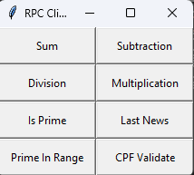

# Atividade - RPC

Este projeto contém uma implementação de um RPC entre Cliente e Servidor em Python, utilizando sockets TCP.

## Estrutura

O projeto contém a seguinte estrutura:

- `server.py`: Implementa o servidor
- `client.py`: Implementa o cliente
- `rpc.py`: Implementa o RPC que faz a comunicação entre o cliente e o servidor

## Cliente

O script `client.py` implementa o cliente RPC que se conecta ao servidor, chama métodos remotos e exibe os resultados.

## Servidor

O script `server.py` implementa o servidor RPC que abre uma conexão TCP na porta 5000 e aguarda requisições do cliente. Recebe chamadas de métodos, executa  e retorna o resultado ao cliente.

## RPC

O script `rpc.py` implementa as classes e métodos utilizados pelo cliente e servidor para fazer a comunicação de forma transparente.

## Execução

Para executar o projeto:

1. Execute o servidor de nomes: `python nameServer.py`.
2. Execute o servidor de operações: `python server.py`.
3. Execute o cliente: `python client.py`

O cliente irá se conectar ao servidor de nomes que retornará para o cliente os servidores que possuem a operação solicitada.
O cliente irá selecionar aleatoriamente um servidor para executar a operação.
O servidor de operações ira executar a operação e retornar o resultado.

## Desenvolvimento

### Semana 1

Implementado o RPC e operações básicas de soma, subtração, divisão e multiplicação.

### Semana 2

Implementados métodos para verificar se um ou mais números são primos e printar números primos em um range.
Adicionado também um método para printar números primos utilizando multiprocessamento, printando o tempo levado entre as execuções sequencial e em paralelo.

### Semana 3

Implementado cache em memória no cliente para armazenar resultados das chamadas de métodos remotos anteriormente realizadas. Desta forma, se um mesmo método for chamado várias vezes com os mesmos parâmetros, o resultado será retornado do cache localmente no cliente em vez de fazer nova requisição ao servidor.

### Semana 4

Implementada a classe Cache, para lidar com toda a lógica de cache no cliente. Agora, o cache é armazenado também em disco. Desta forma, os resultados são persistidos entre execuções do cliente.

### Semana 5

Refatoração no envio dos dados do servidor e recebimento pelo cliente. Agora os dados são transmitidos utilizando JSON.  
Implementada operação `last_news_if_barbacena` para coletar o título de um número definido de notícias do site do Campus Barbacena utilizando multithreading.

### Semana 6

O mecanismo de cache na operação `last_news_if_barbacena`, irá lidar com requisições onde o número de notícias solicitadas seja menor que um número previamente solicitado, aproveitando-se dos resultados já obtidos anteriormente. Além disso, foi implementado um mecanismo para atualizar os resultados do cache caso tenha passado 5 minutos desde a ultima requisação à operação `last_news_if_barbacena`, garantindo dados atualizados.

### Semana 7

Implementado um servidor de nomes. Agora o cliente conecta no servidor e solicita endereços para determinada operação. A consulta é feita via UDP.  
O servidor de nomes irá retornar uma lista de endereços de servidores que implementam a operação requisitada pelo cliente, e o cliente irá escolher aleatóriamente um dos servidores para executar a operação. Caso um servidor da lista não esteja disponível, o cliente irá escolher outro servidor.  
Em caso de erro de conexão ao servidor de nomes, o cliente tem um timeout de 1 segundo.  
O limite de tentativas de conexão aos servidores de operações é de 5 vezes.

### Semana 8

Implementado o método *valida_cpf*, que retorna *true* caso o CPF recebido seja válido e *false* caso contrário.
Implementado sistema de log para auditoria, onde um arquivo texto é criado para cada servidor e armazena *timestamp*, *IP do cliente*, *nome da operação* e *tempo de resposta* para cada operação executada.
Criado shell script que exibe analisa os logs e exibe todos os IPs únicos que fizeram requisições.
Implementado SSL para criptografia dos dados enviados entre o cliente e o servidor.

### Semana Final

Implementada interface simples com Tkinter, onde o usuário pode selecionar qual operação deseja executar e informar os parâmetros.
